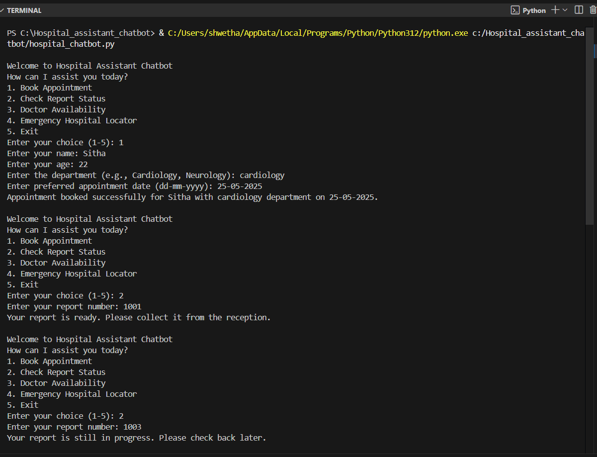
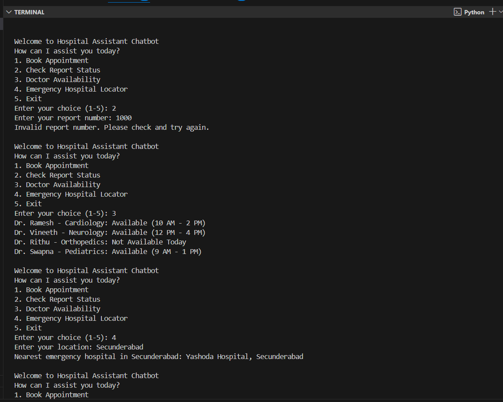
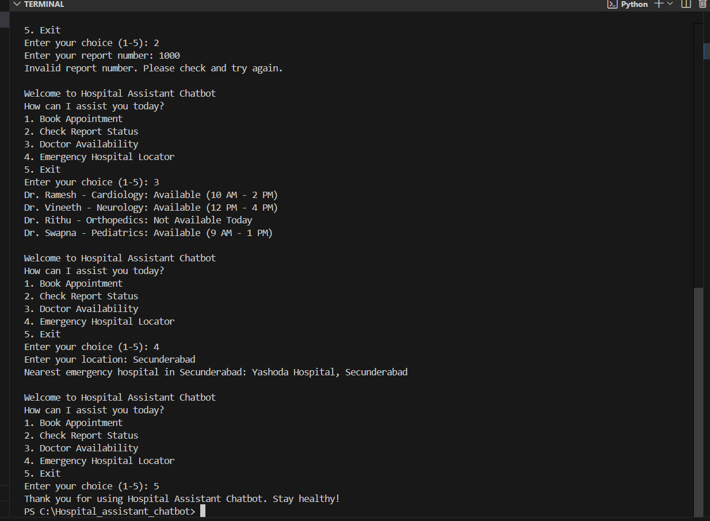

# Hospital Assistant Chatbot

This project is a simple **Hospital Assistant Chatbot** that helps users interact with a hospital system using basic chatbot functionality. It can provide information, respond to user input, and assist with basic queries like doctor availability, timings, and appointments.

## Features

- Responds to patient queries using predefined logic
- Can guide users about hospital departments and services
- Simple and interactive console interface

## How It Works

The chatbot processes user inputs and matches them against known questions or keywords. Based on this, it provides relevant responses.

## Technologies Used

- Python 3
- Basic logic-based chatbot implementation (no external ML/NLP libraries)

## Screenshots

Here are a few example outputs of how the chatbot works:

### 1. Startup Screen


### 2. Example Interaction


### 3. End of Session / Exit


## How to Run

1. Clone the repository:
   ```bash
   git clone https://github.com/your-username/hospital-assistant-chatbot.git
   cd hospital-assistant-chatbot

## 1. Run the Python script:

python hospital_chatbot.py

## 2. Follow the prompts and interact with the chatbot.
